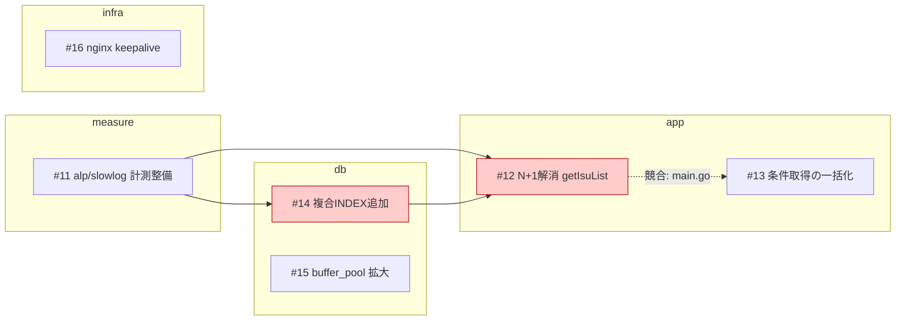
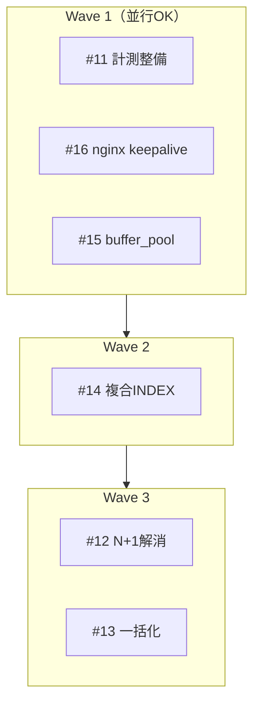

# 並行作業プランの可視化

`/summarize-issues` が作成した Issue 群を解析し、**カテゴリ毎に「どれとどれを同時に進められるか」**を可視化してください。
目的は ISUCON 本番で複数人が手を止めずに動けるようにすることです。

当日の競技時間を削らないため、**Issue 本文の抽出（§2）と競合の実物検証（§4）はサブエージェントで並列化する**。
ただし**判断は直列で1箇所に集める**（§3 突き合わせ / §5 論理依存と Wave / §6 出力）。
並行可・直列必須の最終判定は全体を見た1つのコンテキストが持つ。

追加指示: $ARGUMENTS

- `--members N` … N 人での分担案まで出す（省略時は 2 人想定。アプリ担当1人、DB/インフラ担当1人）
- `app` / `db` / `infra` / `measure` … そのカテゴリだけに絞る（省略時は全カテゴリ）
- `--dry-run` … Dashboard へのコメント投稿をせず、ターミナル出力のみ
- `--serial` … 並列化せず1つのコンテキストで同じ手順を順番に実行する（判定基準は一切変えない）。
  サブエージェントを起動できない環境でも同じ挙動にする

## 実行の全体像

```
§0 対象 Issue の収集      直列（**本文は取らない**。番号・タイトル・ラベルだけ）
§1 下地の取得             直列（Dashboard の「影響ファイル一覧」＝候補ペアの当たり）
§2 Issue 情報の抽出       並列3〜4（1体 = 数件。本文は各体が自分で取る）→ 圧縮レコードだけ返す
§3 突き合わせ             直列（ファイル→Issue 表・検証対象ファイルと候補ペアの確定）
§4 競合の実物検証         並列（**1ファイル = 1体**・同時最大5）→ ペアごとの判定
§5 論理依存と Wave        直列（ここが精度のアンカー）
§6 出力生成               直列（サマリ・カテゴリ毎の表・mermaid・人数割り当て）
§7 投稿
§8 最終報告
```

**バリアは3つある。ここを飛ばすと精度が落ちる。**
- §2 の完了 → 全 Issue の影響ファイルが揃うまで候補ペアは確定しない（1件欠けるとペアが漏れる）
- §4 の完了 → 判定が1つ欠けると Wave の構成が変わる。**欠けは `直列必須` として扱う**
- §5 の完了 → Wave が確定するまで出力を書き始めない

## 0. 対象 Issue の収集（ここを間違えない）

**`/summarize-issues` が生成した Issue だけ**を対象にする。以下の順で試し、最初にヒットした方法を使う。

```sh
# 1) 本文マーカーで絞る（最優先）
gh issue list --state open --limit 200 \
  --search 'in:body "generated-by: /summarize-issues"' \
  --json number,title,url,labels

# 2) Dashboard Issue のチェックリストから番号を拾う
gh issue list --state open --label dashboard --limit 5 --json number,title

# 3) それでも取れない場合は category:* ラベル付きの Issue
gh issue list --state open --limit 200 --json number,title,url,labels \
  --search 'label:category:app,category:db,category:infra,category:measure'
```

- **`--json` に `body` を含めない。** 本文は §2 のサブエージェントが1件ずつ取る。
  本体のコンテキストを本文で埋めると、以降の判定と出力生成が遅くなる（ここが最大の遅延要因）。
- どの方法でも 0 件なら、**先に `/summarize-issues` を実行してください**と伝えて終了する。勝手に Issue を作らない。
- 手動で作られた無関係な Issue（マーカーも `category:*` ラベルも無いもの）は対象外。除外したものは最後に報告する。
- クローズ済み Issue は対象外（`--state open`）。ただし「依存元が既に完了している」判定のために、必要なら `--state closed` も参照してよい。
- 絞り込み（`app` など）が指定されていれば、この時点で対象を絞る（後続の並列数がそのまま減る）。

## 1. 下地の取得（Dashboard の影響ファイル一覧）

Dashboard Issue の「影響ファイル一覧（競合チェック用）」は、`/summarize-issues` が各 Issue の申告を集計した表。
**候補ペアの当たりを付けるためだけに使う。**

```sh
gh issue view <dashboard-number> --json number,body -q .body
```

- Dashboard が無ければこの節はスキップする（§3 の表を §2 の抽出結果だけで作る）。
- **この表を最終判定に使わない。** Issue 本文が後から編集されていれば古い。§2 の抽出結果を常に正とする。
- 表と §2 の結果が食い違ったら、その差分を §8 で報告する（Dashboard が古くなっている合図）。

## 2. Issue 情報の抽出（並列3〜4）

**割り当て**: 対象 Issue を件数がほぼ均等になるよう3〜4グループに分ける。
本文しか読まないので分け方は任意（カテゴリ単位でよい）。ただし**1 Issue = 1体**にする（同じ Issue を2体に読ませない）。
対象が5件以下なら並列化せず本体が処理する（起動コストの方が高い）。

### 2-1. サブエージェント共通の前置き（§2 と §4 のプロンプト先頭にそのまま貼る）

```
あなたは ISUCON 参加チームの作業計画担当の補助です。目的は並行作業プランの材料集めです。

必ず守ること:
- 推測でパスや行番号を書かない。出すパスは Read / Grep / Glob で実在を確認したものだけにする
- 本文に書かれていないことを補完しない。書かれていなければ「記載なし」と返す
- 該当箇所を特定できない場合は「要確認」と返す。**推測で「並行可」と言わない**
- 外部 Web を参照しない（WebFetch / WebSearch を使わない）

禁止:
- GitHub Issue の作成・編集・クローズ・コメント投稿
- アプリケーションコードや設定ファイルの修正（この作業は調査のみ）
- 他のエージェント（Agent / Task）の起動
- Wave の構成・優先度の変更・担当者の割り当て（全体を見る担当が決めるので触らない）

返り値は指定されたフォーマットのブロックの連結だけにする。前置き・感想・要約は書かない。
```

### 2-2. 各抽出エージェントがやること

1. 担当 Issue の本文を自分で取る:
   ```sh
   gh issue view <number> --json number,title,url,labels,body
   ```
2. 本文（`/summarize-issues` のテンプレート）から次を読み取る。
   - `## 影響ファイル` の表 → **ファイルパス / 変更種別 / 変更内容**
   - `### 再起動・反映が必要なもの` → app / mysql / nginx / SQL再投入 / `/initialize`
   - `### 他Issueとの競合` → Issue 側の自己申告（**タイトルで書かれている**。番号ではない）
   - ラベル → `category:*`, `priority:*`
3. **表のパスを実在確認する。** `新規` 以外のパスは Glob / `test -e` で確認し、行番号が書いてあれば
   Read / Grep でその範囲に本当に該当コードがあるかを見る。ずれていれば実際の値に直す。
   存在しない・`（未pull・要確認）` のものは **判定不能** として印を付ける。
4. §2-3 のフォーマットで返す。**競合・依存・Wave の判定はしない**（表の突き合わせは本体がやる）。

影響ファイル表が無い、または `（未pull・要確認）` の Issue は **判定不能** として返す。
本体はそれを別枠にまとめ、`sh ./pull.sh` 後の再実行を促す（推測で並行可と言わない）。

### 2-3. 返り値フォーマット（固定）

1 Issue = 1ブロック。これ以外を返さない。

```
### #12
- タイトル: N+1解消 getIsuList
- カテゴリ: app / 優先度: high
- 影響ファイル:
  - `webapp/go/main.go:412-438 (getIsuList)` 修正 — ループ内クエリを IN 句の一括取得に置換 [実在確認済み]
  - `webapp/sql/1_InitData.sql` 修正 — 複合INDEXを追加 [実在確認済み]
- 再起動・反映: app / SQL再投入
- 自己申告の競合: 「[App] 条件取得の一括化」
- 判定不能: なし
```

- 行番号が本文と実物でずれていた場合は**実物の値**を書き、末尾に `[本文の申告は 400-430]` と添える。
- `判定不能` は理由まで書く（例: `webapp/ が未pull`、`申告パス webapp/go/handler.go が存在しない`）。

## 3. 突き合わせ（直列・安い）

抽出レコードが**全部返ってきてから**、1回だけ組み立てる。扱うのは本文ではなく圧縮済みのレコードなので安い。

1. 全レコードから **ファイル → 触る Issue** の表を作る。
   パスは正規化して突き合わせる（先頭の `./` を落とす、リポジトリルートからの相対パスに揃える）。
2. **2件以上が触るファイル**を検証対象ファイルとする。1件だけのファイルは検証不要
   （そのファイルしか触らない Issue は「単独でいつでも着手可」の材料になる）。
3. 検証対象ファイルごとに、そのファイルを触る Issue の**候補ペア**を列挙する。
4. §1 の下地と食い違いがあれば §2 のレコードを正とし、差分を §8 の報告用に残す。
5. **判定不能** の Issue は候補ペアに入れない。別枠に置き、Wave にも入れない。
6. 候補ペアが 0 件なら §4 をまるごと飛ばす（全 Issue が別ファイル＝全部並行可）。

## 4. 競合の実物検証（並列・1ファイル = 1体）

Issue の自己申告を**そのまま信じない**。実ファイルを確認して判定する。

### 4-1. 割り方

**ペアで割らず、ファイルで割る。**

- ペアで割ると、同じファイル（`main.go` など）を何体もが読み直して遅い。
  6 Issue が触るファイルは 15 ペアあるが、**読むべきファイルは1つ**。
- さらにペアで割ると、**同じファイルについて矛盾した判定**が出る（片方は「別関数だから並行可」、
  もう片方は「同一ハンドラだから直列必須」）。1ファイル = 1体なら一貫して裁ける。
- 触る Issue が多いファイルが最も重く、**そこが全体の所要時間を決める**。
  小さいファイルは1体に複数割り当ててよい。同時実行は最大5。

各体への入力: ファイルパス / そのファイルを触る Issue の一覧（番号・タイトル・該当箇所・変更内容）/ 判定基準（§4-2）。

### 4-2. 各検証エージェントがやること

§2-1 の共通前置きをそのまま使う。そのうえで:

1. 担当ファイルを Read / Grep して、**各 Issue の該当箇所を実際に特定する**（関数名と行範囲）。
2. ペアごとに判定する。
   - 別の関数・別のハンドラ・設定ファイルの別ブロック・重ならない行範囲 → `並行可（要注意）`
   - 同じ関数・同じ SQL 文・同じ `server {}` ブロック・重なる行範囲 → `直列必須`
   - 該当箇所が特定できない → `要確認`（**推測で並行可にしない**）
3. 判定には必ず根拠を添える（例: `main.go:412 getIsuList` と `main.go:980 postIsuCondition` で重複なし）。
4. 担当ファイル以外のペアは判定しない。

### 4-3. 返り値フォーマット（固定）

1ファイル = 1ブロック。

```
### `webapp/go/main.go`
- #12 × #13: 直列必須 — どちらも `getIsuList` (412-438) を書き換える
- #12 × #17: 並行可（要注意） — #12 は `getIsuList` (412-438)、#17 は `postIsuCondition` (980-1030) で重複なし
- #13 × #17: 並行可（要注意） — 同上（関数が別）
- #12 × #19: 要確認 — #19 の申告 `main.go:1200` に該当コードが無い（ファイルは1100行）
```

### 4-4. 判定の照合（省略しない）

並列検証では**判定が静かに欠ける**。§5 に進む前に必ず照合する。

1. §3 で列挙した候補ペア全件に判定が付いているか突き合わせる。
2. 欠けているペアは**そのペアだけ直列で1回再判定**する。
3. それでも判定できないペアは **`直列必須` として扱う**。安全側に倒す方向はこちら。
   並行可に倒して実際にコンフリクトすると、当日の時間を大きく失う。
4. 安全側に倒したペアは §8 に「未検証のため直列扱い」として明記する（黙って直列にしない）。

## 5. 論理依存と Wave の構成（直列・精度のアンカー）

ここは分散させない。**全レコードと全判定を1つのコンテキストで見て決める**
（片方の Issue しか見ていない担当は順序を誤る）。

### 5-1. 論理依存（順序が決まっているもの）

- スキーマ / INDEX 変更 → それを前提にクエリを書き換える Issue（先にスキーマ）
- キャッシュ層の新規追加 → それを使う Issue（先に基盤）
- 計測整備（`category:measure`） → 効果測定が必要な Issue（先に計測）
- テーブル分割・カラム追加 → 初期データ投入 SQL / `/initialize` の修正
- 複数台構成への分離 → 各サーバ向けの設定変更

### 5-2. 競合ではないもの（並行可と明記する）

- 触るファイルが完全に別（例: `nginx.conf` と `webapp/go/main.go`）
- 再起動対象が同じ（両方 mysql 再起動が必要）だけの関係 → 実装は並行可
- カテゴリが違うだけ → それ自体は根拠にならない

### 5-3. ベンチ・デプロイの直列制約（重要）

- **ベンチマークは同時に1本しか回せない**。実装は並行できても**計測は必ず直列**。
- `.github/workflows/cd.yaml` は `push: branches: [main]` トリガー。つまり **`main` へのマージが即デプロイ**であり、複数 PR を連続マージすると**どの施策が効いたか切り分けられない**。
- `deploy.sh` は app / nginx / mysql をまとめて再起動しログもローテートするため、**デプロイ自体が全台に影響する**。誰かのデプロイ中は他の計測結果が汚れる。
- よって「実装並行 → 1本ずつマージ → 1本ずつベンチ → `/analyze`」を前提に順序を出す。

### 5-4. Wave に分ける

カテゴリ（app / db / infra / measure）**ごとに**、Wave（同時着手できるまとまり）に分割する。

- Wave 1 = 依存が無く、互いにファイル競合しない Issue
- Wave 2 = Wave 1 のどれかに依存する、または Wave 1 と競合する Issue
- 各 Wave 内は「同時に着手して良い」ことを保証する（1ファイルを2人が触らない）
- 優先度（`priority:*`）が高いものを早い Wave に寄せる
- `直列必須` のペアは同じ Wave に入れない。`要確認` と §4-4 で安全側に倒したペアも**同じ Wave に入れない**

## 6. 出力フォーマット

### 6-1. サマリ

```md
対象 Issue: 12件（app 5 / db 4 / infra 2 / measure 1）
判定不能: 1件（#20 未pull）
クリティカルパス: #11 → #14 → #12（推定 3ステップ）
同時に着手できる最大数: 4
```

### 6-2. カテゴリ毎の並行グループ（メインの成果物）

カテゴリごとに必ずこの形式で出す。

```md
## app
| Wave | 並行して着手できる Issue | 触るファイル | 並行可の根拠 |
| --- | --- | --- | --- |
| 1 | #12, #17 | `main.go:412 getIsuList` / `nginx.conf` 経由なし | 編集箇所が重複なし |
| 2 | #13 | `main.go:980` | #12 と同ファイル。#12 マージ後に着手 |

**直列必須のペア**
- #12 → #13 : `webapp/go/main.go` の同一ハンドラを触る
- #14 → #12 : #12 は #14 で追加する INDEX 前提

**単独でいつでも着手可**
- #17 : 他 Issue と1ファイルも重複しない

**要確認（並行可と断定していない）**
- #12 × #19 : #19 の申告パスに該当コードが無い。#19 の本文を直してから再実行

## db
（同じ形式）

## infra
（同じ形式）

## measure
（同じ形式）
```

### 6-3. 依存・競合グラフ（mermaid）

GitHub のコメント上でレンダリングされるので mermaid で書く。

- 実線矢印 `-->` = 依存（先に完了が必要）
- 破線 `-.->` かつラベル `競合:ファイル名` = 同時編集不可
- カテゴリごとに `subgraph`



### 6-4. Wave ビュー（時間軸）



### 6-5. 人数割り当て案

`--members N`（省略時 2。アプリ担当1人、DB/インフラ担当1人）で、各メンバーに競合しない Issue を割り当てる。

```md
| メンバー | Wave 1 | Wave 2 | 担当領域 |
| --- | --- | --- | --- |
| A | #11 | #14 | 計測 → DB |
| B | #16 | #18 | インフラ（appコードを触らない） |
| C | #15 | #12 | DB設定 → アプリ |
```

- 1人がカテゴリを跨いでも良いが、**同じファイルを2人に割り当てない**こと。
- 「マージ・計測担当」を1人決める運用を添える（ベンチが直列だから）。

### 6-6. 運用メモ

- マージ順の推奨（効果の切り分けができる順）
- 同時にデプロイしてはいけない組み合わせ
- 各 Wave 完了後にやること（ベンチ → `/analyze` → 次 Wave の見直し）

## 7. 投稿

- `--dry-run` でなければ、**Dashboard Issue にコメントとして投稿**する（新しい Issue は作らない）。

```sh
gh issue comment <dashboard-number> --body-file /tmp/parallel-plan.md
```

- 既に同じコメント（`<!-- generated-by: /parallel-plan -->` 付き）がある場合は、新規追加ではなく `gh issue comment --edit-last` で更新する。
- コメント本文末尾に `<!-- generated-by: /parallel-plan -->` を入れる。
- Dashboard Issue が見つからない場合はターミナル出力のみにし、その旨を伝える。

## 8. 最終報告

- カテゴリ毎の「同時着手できる Issue の組」を箇条書きで再掲
- クリティカルパスと、そこがボトルネックになる理由
- 判定不能だった Issue と、判定に必要な情報
- **未検証のため `直列必須` に倒したペア**（あれば。無ければ「なし」と明記）
- **Dashboard の「影響ファイル一覧」と Issue 本文の食い違い**（あれば。Dashboard が古い合図）
- 投稿した Dashboard コメントの URL
- **並列実行の結果**: §2 の体数と担当件数、§4 で検証したファイル数と体数、再判定したペア

## 禁止事項

- Issue の作成・クローズ・本文編集をしない（コメント投稿のみ）
- アプリケーションコードや設定ファイルを修正しない
- 実ファイルを見ずに「並行できる」と断定しない。確認できない場合は `要確認` と書く
- `/summarize-issues` 由来でない Issue を勝手に対象に含めない
- **全 Issue の本文を本体のコンテキストに流し込まない**（`gh issue list --json body` を一括で使わない）
- **ペアで検証を割らない。ファイルで割る**（同じファイルの再読み込みと、矛盾した判定の原因になる）
- **抽出エージェント（§2）に競合・依存・Wave を判定させない**（部分しか見えていない）
- **検証エージェント（§4）に Wave を組ませない**（担当ファイル外の依存を知らない）
- **未検証・要確認のペアを「並行可」に倒さない**（安全側は `直列必須`）
- **§4-4 の照合を省略しない**（並列化で判定が静かに欠けるため、ここが唯一の検出手段）
- **下地（Dashboard の影響ファイル一覧）だけで判定を確定させない**（本文が編集されていれば古い）
- サブエージェントにさらにサブエージェントを起動させない
