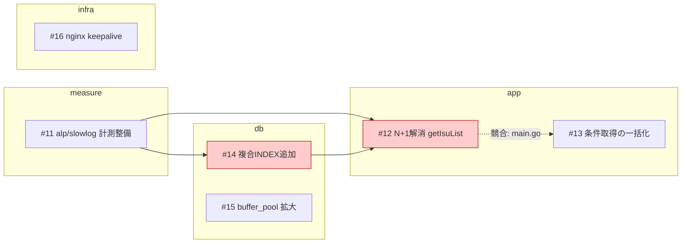
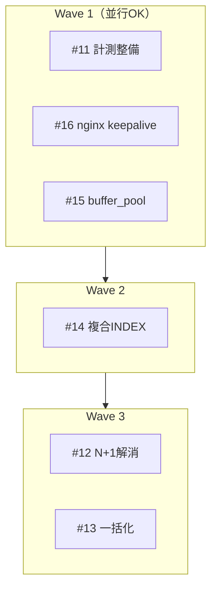

# 並行作業プランの可視化

`/summarize-issues` が作成した Issue 群を解析し、**カテゴリ毎に「どれとどれを同時に進められるか」**を可視化してください。
目的は ISUCON 本番で複数人が手を止めずに動けるようにすることです。

追加指示: $ARGUMENTS

- `--members N` … N 人での分担案まで出す（省略時は 2 人想定。アプリ担当1人、DB/インフラ担当1人）
- `app` / `db` / `infra` / `measure` … そのカテゴリだけに絞る（省略時は全カテゴリ）
- `--dry-run` … Dashboard へのコメント投稿をせず、ターミナル出力のみ

## 0. 対象 Issue の収集（ここを間違えない）

**`/summarize-issues` が生成した Issue だけ**を対象にする。以下の順で試し、最初にヒットした方法を使う。

```sh
# 1) 本文マーカーで絞る（最優先）
gh issue list --state open --limit 200 \
  --search 'in:body "generated-by: /summarize-issues"' \
  --json number,title,url,labels,body

# 2) Dashboard Issue のチェックリストから番号を拾う
gh issue list --state open --label dashboard --json number,title,body

# 3) それでも取れない場合は category:* ラベル付きの Issue
gh issue list --state open --limit 200 --json number,title,url,labels,body \
  --search 'label:category:app,category:db,category:infra,category:measure'
```

- どの方法でも 0 件なら、**先に `/summarize-issues` を実行してください**と伝えて終了する。勝手に Issue を作らない。
- 手動で作られた無関係な Issue（マーカーも `category:*` ラベルも無いもの）は対象外。除外したものは最後に報告する。
- クローズ済み Issue は対象外（`--state open`）。ただし「依存元が既に完了している」判定のために、必要なら `--state closed` も参照してよい。

## 1. 各 Issue から情報を抽出

本文（`/summarize-issues` のテンプレート）から次を読み取る。

- `## 影響ファイル` の表 → **ファイルパス / 変更種別 / 変更内容**
- `### 再起動・反映が必要なもの` → app / mysql / nginx / SQL再投入 / `/initialize`
- `### 他Issueとの競合` → Issue 側の自己申告
- ラベル → `category:*`, `priority:*`

影響ファイル表が無い、または `（未pull・要確認）` の Issue は **判定不能** として別枠にまとめ、`sh ./pull.sh` 後の再実行を促す（推測で並行可と言わない）。

## 2. 競合・依存の判定

Issue の自己申告を**そのまま信じない**。実ファイルを確認して判定する。

### ファイル競合（同時に編集するとコンフリクトする）

1. 影響ファイル表を突き合わせ、**同じパスを触る Issue の組**を洗い出す。
2. 同じファイルでも、Read / Grep で該当箇所を確認し、**編集範囲が離れているか**を見る。
   - 別の関数・別のハンドラ・設定ファイルの別ブロック → `並行可（要注意）`
   - 同じ関数、同じ SQL 文、同じ `server {}` ブロック → `直列必須`
3. 判定は必ず根拠を添える（例: `main.go:412 getIsuList` と `main.go:980 postIsuCondition` で重複なし）。

### 論理依存（順序が決まっているもの）

- スキーマ / INDEX 変更 → それを前提にクエリを書き換える Issue（先にスキーマ）
- キャッシュ層の新規追加 → それを使う Issue（先に基盤）
- 計測整備（`category:measure`） → 効果測定が必要な Issue（先に計測）
- テーブル分割・カラム追加 → 初期データ投入 SQL / `/initialize` の修正
- 複数台構成への分離 → 各サーバ向けの設定変更

### 競合ではないもの（並行可と明記する）

- 触るファイルが完全に別（例: `nginx.conf` と `webapp/go/main.go`）
- 再起動対象が同じ（両方 mysql 再起動が必要）だけの関係 → 実装は並行可
- カテゴリが違うだけ → それ自体は根拠にならない

### ベンチ・デプロイの直列制約（重要）

- **ベンチマークは同時に1本しか回せない**。実装は並行できても**計測は必ず直列**。
- `.github/workflows/cd.yaml` は `push: branches: [main]` トリガー。つまり **`main` へのマージが即デプロイ**であり、複数 PR を連続マージすると**どの施策が効いたか切り分けられない**。
- `deploy.sh` は app / nginx / mysql をまとめて再起動しログもローテートするため、**デプロイ自体が全台に影響する**。誰かのデプロイ中は他の計測結果が汚れる。
- よって「実装並行 → 1本ずつマージ → 1本ずつベンチ → `/analyze`」を前提に順序を出す。

## 3. カテゴリ毎の並行グループを組む

カテゴリ（app / db / infra / measure）**ごとに**、Wave（同時着手できるまとまり）に分割する。

- Wave 1 = 依存が無く、互いにファイル競合しない Issue
- Wave 2 = Wave 1 のどれかに依存する、または Wave 1 と競合する Issue
- 各 Wave 内は「同時に着手して良い」ことを保証する（1ファイルを2人が触らない）
- 優先度（`priority:*`）が高いものを早い Wave に寄せる

## 4. 出力フォーマット

### 4-1. サマリ

```md
対象 Issue: 12件（app 5 / db 4 / infra 2 / measure 1）
判定不能: 1件（#20 未pull）
クリティカルパス: #11 → #14 → #12（推定 3ステップ）
同時に着手できる最大数: 4
```

### 4-2. カテゴリ毎の並行グループ（メインの成果物）

カテゴリごとに必ずこの形式で出す。

```md
## app
| Wave | 並行して着手できる Issue | 触るファイル | 並行可の根拠 |
| --- | --- | --- | --- |
| 1 | #12, #17 | `main.go:412 getIsuList` / `nginx.conf` 経由なし | 編集箇所が重複なし |
| 2 | #13 | `main.go:980` | #12 と同ファイル。#12 マージ後に着手 |

**直列必須のペア**
- #12 → #13 : `webapp/go/main.go` の同一ハンドラを触る
- #14 → #12 : #12 は #14 で追加する INDEX 前提

**単独でいつでも着手可**
- #17 : 他 Issue と1ファイルも重複しない

## db
（同じ形式）

## infra
（同じ形式）

## measure
（同じ形式）
```

### 4-3. 依存・競合グラフ（mermaid）

GitHub のコメント上でレンダリングされるので mermaid で書く。

- 実線矢印 `-->` = 依存（先に完了が必要）
- 破線 `-.->` かつラベル `競合:ファイル名` = 同時編集不可
- カテゴリごとに `subgraph`



### 4-4. Wave ビュー（時間軸）



### 4-5. 人数割り当て案

`--members N`（省略時 3）で、各メンバーに競合しない Issue を割り当てる。

```md
| メンバー | Wave 1 | Wave 2 | 担当領域 |
| --- | --- | --- | --- |
| A | #11 | #14 | 計測 → DB |
| B | #16 | #18 | インフラ（appコードを触らない） |
| C | #15 | #12 | DB設定 → アプリ |
```

- 1人がカテゴリを跨いでも良いが、**同じファイルを2人に割り当てない**こと。
- 「マージ・計測担当」を1人決める運用を添える（ベンチが直列だから）。

### 4-6. 運用メモ

- マージ順の推奨（効果の切り分けができる順）
- 同時にデプロイしてはいけない組み合わせ
- 各 Wave 完了後にやること（ベンチ → `/analyze` → 次 Wave の見直し）

## 5. 投稿

- `--dry-run` でなければ、**Dashboard Issue にコメントとして投稿**する（新しい Issue は作らない）。

```sh
gh issue comment <dashboard-number> --body-file /tmp/parallel-plan.md
```

- 既に同じコメント（`<!-- generated-by: /parallel-plan -->` 付き）がある場合は、新規追加ではなく `gh issue comment --edit-last` で更新する。
- コメント本文末尾に `<!-- generated-by: /parallel-plan -->` を入れる。
- Dashboard Issue が見つからない場合はターミナル出力のみにし、その旨を伝える。

## 6. 最終報告

- カテゴリ毎の「同時着手できる Issue の組」を箇条書きで再掲
- クリティカルパスと、そこがボトルネックになる理由
- 判定不能だった Issue と、判定に必要な情報
- 投稿した Dashboard コメントの URL

## 禁止事項

- Issue の作成・クローズ・本文編集をしない（コメント投稿のみ）
- アプリケーションコードや設定ファイルを修正しない
- 実ファイルを見ずに「並行できる」と断定しない。確認できない場合は `要確認` と書く
- `/summarize-issues` 由来でない Issue を勝手に対象に含めない
